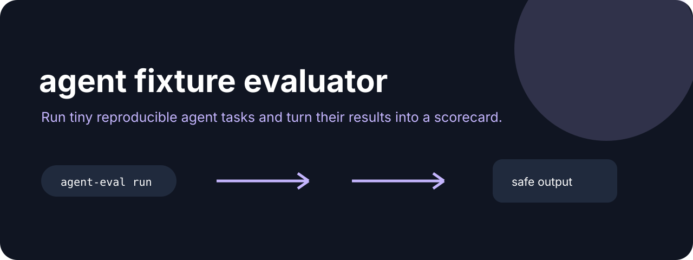

# Agent Eval Kit



**Run tiny reproducible agent tasks and turn their results into a scorecard.**

[](https://github.com/jonah-ux/agent-eval-kit/actions/workflows/ci.yml)
[](https://www.python.org/)
[](LICENSE)

Agent Eval Kit keeps a small task fixture beside the command it evaluates. The result is
structured JSON with the expected exit code, required stdout, stderr, timeout state, and duration.
It is deliberately tiny enough to understand before putting it in an agent loop or CI job.

## Try it in 30 seconds

```bash
git clone --depth 1 https://github.com/jonah-ux/agent-eval-kit.git
cd agent-eval-kit
python -m pip install .
python demos/demo.py
```

The demo runs one fixture and prints an `agent-eval/v1` scorecard. For a real fixture:

```json
{"task":"hello","expect_stdout":["hello"],"timeout":10}
```

```bash
cat > fixture.json <<'JSON'
{"task":"hello","expect_stdout":["hello"],"timeout":10}
JSON
agent-eval run fixture.json --command 'printf {task}'
```

## See it work

The bundled demo produces a scorecard that a CI job or another agent can consume directly:

```json
{"schema":"agent-eval/v1","ok":true,"exit_code":0,"expected_exit":0,"stdout":"hello","stderr":"","duration_ms":21,"timed_out":false}
```

Open the [candidate trial scorecard walkthrough](docs/walkthrough.html) for a visual tour of
fixtures, repeated trials, stability, and ranking. The browser board is an illustrative snapshot;
the commands below are the real CLI path and are never invoked by the page.

## Compare candidates with repeated trials

Use a matrix when one fixture is too small to compare two agent commands. A
`agent-eval/matrix/v1` plan names the fixtures, candidate commands, and number
of repeated trials:

```json
{
  "schema": "agent-eval/matrix/v1",
  "trials": 3,
  "fixtures": [
    {"id": "greeting", "task": "hello", "expect_stdout": ["hello"]},
    {"id": "farewell", "task": "bye", "expect_stdout": ["bye"]}
  ],
  "candidates": [
    {"id": "baseline", "command": "printf {task}"},
    {"id": "candidate", "command": "python agent.py {task}"}
  ]
}
```

```bash
agent-eval matrix plan.json
```

The matrix output is `agent-eval/matrix/v1`. It includes a SHA-256 fingerprint
of the canonical plan, every individual trial scorecard, per-fixture and
per-candidate pass rates, minimum/mean/maximum durations, per-fixture
repeated-observation stability, and a ranking sorted by pass rate, then mean
duration, then candidate ID. Equivalent JSON key
ordering produces the same plan fingerprint, while command output and timing
remain visible so a caller can inspect nondeterminism rather than hiding it.
The `stable` flag compares non-timing behavior fingerprints within each
fixture's repeated trials; duration changes do not make a behavior unstable.
The command exits `1` when any trial fails, including a timeout. Matrix plans
allow at most 100 trials to keep accidental evaluation explosions bounded.

## Score saved sandbox receipts

Agent Eval Kit can score a saved `agent-sandbox/v2` receipt without rerunning
the command. It verifies the receipt digest, expected exit, timeout state, and
selected stdout fragments, then emits `agent-eval/receipt/v1`:

```bash
agent-eval receipt receipt.json --expect-exit 0 --expect-stdout consumer --require-integrity
```

Execution and evaluation stay separate: Sandbox Run owns what ran, while Agent
Eval owns whether the saved receipt satisfies a fixture contract.

## Related tools

Use [Agent Policy](https://github.com/jonah-ux/agent-policy) to decide whether an action is allowed, [Agent Proof](https://github.com/jonah-ux/agent-proof) to record what happened, and [Context Pack](https://github.com/jonah-ux/context-pack) to bound the input an agent sees.

## What it checks

- The command exits with the expected status.
- Required stdout fragments are present.
- stderr, timeout state, and elapsed time stay visible to the caller.
- Matrix plans compare candidates over the same fixture/trial grid.
- A failed expectation returns exit code `1` for CI and agents.

## Development

```bash
python -m unittest discover -s tests
python -m build --sdist --wheel
```

The matrix plan is deliberately provider-neutral. Commands run with the host
shell and are not sandboxed or network-isolated; use a disposable environment
when evaluating untrusted agents.

Read [CONTRIBUTING.md](CONTRIBUTING.md) before adding fixtures. This tool evaluates a command;
it does not claim to sandbox or secure that command.

MIT licensed.
