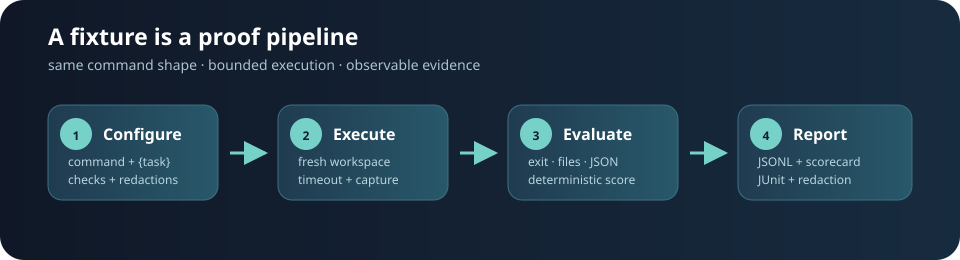

# agent-eval-kit

Provider-neutral fixture evaluation for agent commands. Configure a command once,
substitute `{task}`, and get bounded execution, observable checks, and deterministic
reports without a provider SDK.



## Install

The runtime has no third-party dependencies. Copy this command into a fresh Python
3.11+ environment:

```text
python3 -m venv .venv && . .venv/bin/activate && python -m pip install "git+https://github.com/jonah-ux/agent-eval-kit.git"
```

No GitHub release or package upload is required for this install path. From a
checkout, use `python -m pip install .` instead.

The optional `bwrap` (Linux) or `sandbox-exec` (macOS) platform tools can be selected
with a config's `"sandbox"` field when an additional OS policy is appropriate; they
are not installed or required by this project.

## Quick start

Run the installed synthetic demo:

```text
agent-eval demo --output demo-results
# score=100 passed=true output=demo-results
```

The command creates `events.jsonl`, `scorecard.json`, and `junit.xml`. The scorecard
contains captured stdout/stderr after configured redaction. A task is only passed
when every configured check passes.

Run a fixture configuration:

```json
{
  "command": ["python3", "fixtures/demo_agent.py", "{task}"],
  "tasks": ["alpha", "beta"],
  "timeout": 5,
  "expected_exit": 0,
  "expected_stdout": ["task="],
  "expected_files": [
    {"path": "result.json", "json": {"status": "ok"}}
  ],
  "redactions": ["secret=\\S+"]
}
```

```text
agent-eval run fixtures/demo.json --output eval-results
```

`{task}` is replaced in each command argument, and every task gets a fresh
workspace. Set `working_directory` when a fixture command uses files from the
checkout; the command still receives the fresh workspace in
`AGENT_EVAL_WORKSPACE`. Commands are launched without a shell. `expected_files` supports existence,
text containment, and JSON-subset checks. `expected_stderr` works like
`expected_stdout`. A timed-out command fails closed and is reported rather than
raising into the caller.

The deliberately failing synthetic fixture demonstrates a non-zero result:

```text
agent-eval run fixtures/failing.json --output failing-results; test "$?" -ne 0
```

## Python API

```python
from agent_eval_kit import EvaluationConfig, run_config

result = run_config(EvaluationConfig(command=("python", "agent.py", "{task}")))
print(result.score, result.passed)
```

Use `emit=` to receive JSON-serializable `task_started` and `task_finished` events.

## Reports and reproducibility

- `events.jsonl`: stable-key-order lifecycle events, one JSON object per line.
- `scorecard.json`: task results, checks, redacted output, and integer percentage score.
- `junit.xml`: one testcase per check for CI test-report integrations.

Timestamps and duration are included as operational metadata; check order, task order,
command substitution, score calculation, and report structure are deterministic for
the same observed command behavior. See `SECURITY.md` before running untrusted
commands and `docs/releasing.md` for packaging checks.

## Development

```text
python -m unittest discover -s tests -v
python -m build
```

CI runs the test suite on Ubuntu and macOS with Python 3.11 and 3.12. See
`CONTRIBUTING.md`, `CHANGELOG.md`, and `docs/releasing.md`.

## License

MIT; see `LICENSE`.
